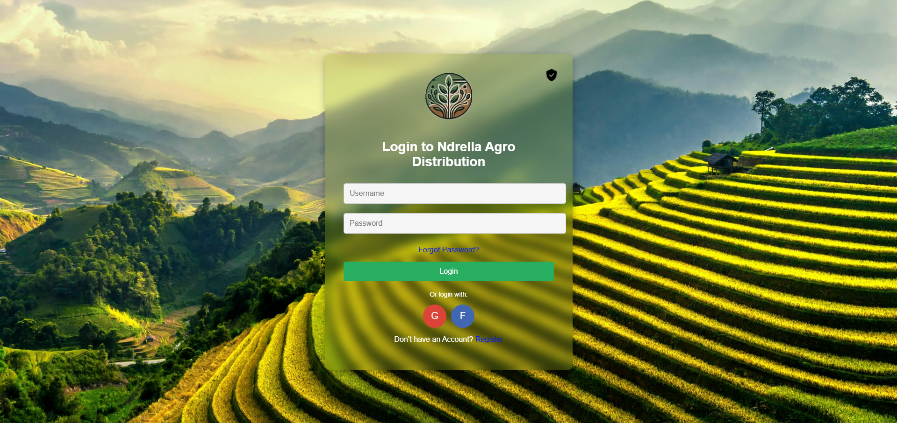
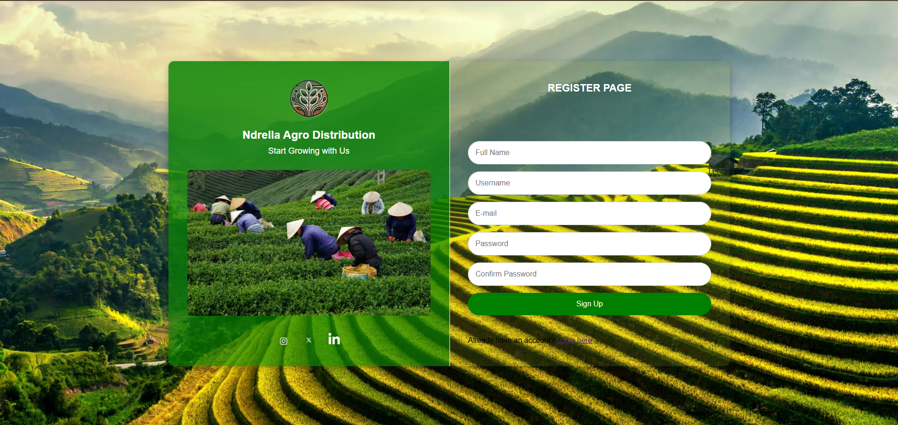
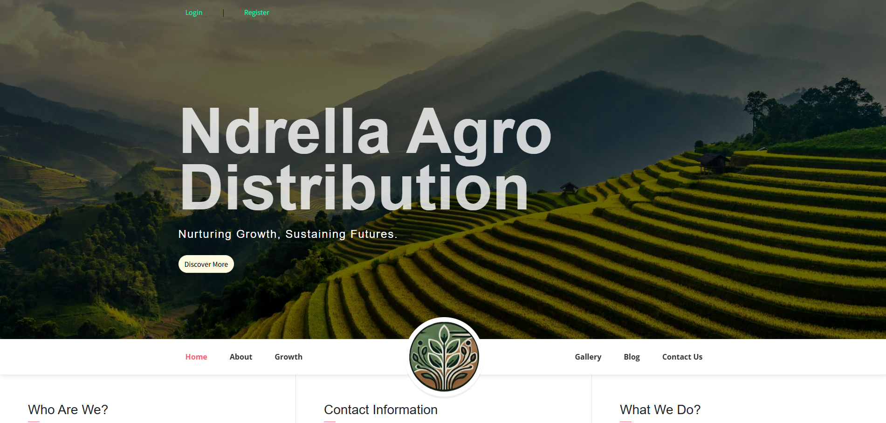
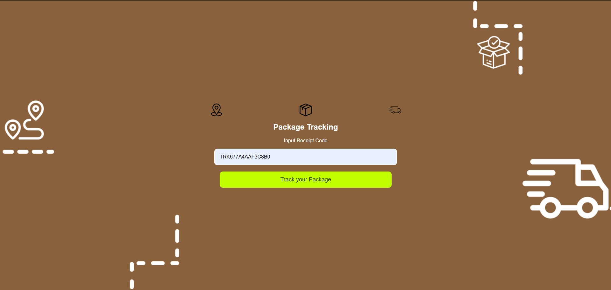
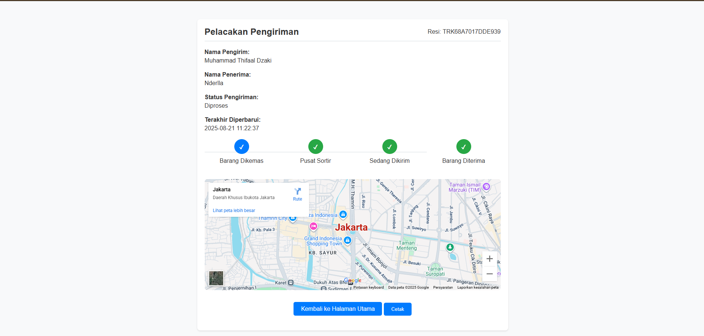

# 🌱 Distribusi Pertanian

Sebuah aplikasi **berbasis web** untuk mendukung distribusi produk pertanian, mencakup **pemesanan bibit, konsultasi pertanian, manajemen pembayaran, hingga pelacakan distribusi produk**.

---

## 🚀 Overview

**Distribusi Pertanian** dirancang untuk mempermudah petani dan konsumen dalam proses distribusi produk pertanian.  
Platform ini hadir dengan konsep **aman, efisien, dan terintegrasi**, sehingga pengguna dapat:

- 🛒 Melakukan **pemesanan bibit & produk pertanian** secara online.  
- 💬 Mengakses layanan **konsultasi pertanian** untuk mendukung keputusan budidaya.  
- 💳 Mengelola **transaksi pembayaran** dengan transparansi.  
- 📦 Melakukan **pelacakan status pesanan** secara real-time.  

---

## ✨ Fitur Utama

- **Pemesanan Bibit** → Pesan bibit dengan mudah langsung dari aplikasi.  
- **Konsultasi Pertanian** → Akses informasi & konsultasi secara online.  
- **Manajemen Pembayaran** → Transaksi cepat & transparan.  
- **Pelacakan Distribusi** → Lacak status pesanan produk Anda.  

---

## 🖼️ Tampilan Aplikasi

Berikut beberapa tampilan dari aplikasi **Distribusi Pertanian**:

### 🔑 Login


### 📝 Registrasi


### 🏠 Halaman Awal


### 📦 Input Tracking


### 🚚 Pelacakan Pengiriman


---

## 🛠️ Teknologi yang Digunakan

- **PHP** → Backend utama aplikasi.  
- **MySQL** → Database penyimpanan data pengguna, pesanan, & transaksi.  
- **Docker** → Containerization untuk aplikasi & database.  

---

## 📂 Struktur Direktori

- `assets/` → File pendukung (gambar, stylesheet, database SQL).  
- `uploads/` → Penyimpanan file yang diunggah pengguna.  
- `vendor/` → Dependensi PHP.  
- `mysql-init/` → Script inisialisasi database.  
- `dockerfile` → Konfigurasi image Docker aplikasi.  
- `docker-compose.yml` → Konfigurasi menjalankan aplikasi & database.  
- `db.php` → Koneksi ke database.  
- `index.php` → Halaman utama aplikasi.  
- `login.php` → Halaman login pengguna.  
- `login_karyawan.php` → Halaman login untuk karyawan.  
- `form_bibit.php` → Form pemesanan bibit.  
- `form_pesanan.php` → Detail pesanan.  
- `formconsul.php` → Konsultasi pertanian.  
- `invoice_payment.php` → Pembayaran tagihan.  
- `footer.php` & `header.php` → Layout dasar web.  

---

## ⚡ Instalasi

Ikuti langkah-langkah berikut untuk menjalankan aplikasi:

1. Clone repositori ini ke mesin lokal Anda:
   ```bash
   git clone https://github.com/username/distribusi-pertanian.git
   ```
2. Masuk ke folder proyek:
   ```bash
   cd distribusi-pertanian
   ```
3. Jalankan aplikasi menggunakan Docker Compose:
   ```bash
   docker-compose up -d --build
   ```
4. Setelah container berjalan, masuk ke dalam container database:
   ```bash
   docker exec -it mysql-db mysql -u root -p
   ```
   > Password root dapat dilihat pada file `docker-compose.yml` di bagian `MYSQL_ROOT_PASSWORD`.

5. Buat database baru (jika belum ada):
   ```sql
   CREATE DATABASE perkebunan;
   USE perkebunan;
   ```
6. Import struktur dan data awal dari file SQL:
   ```bash
   docker exec -i mysql-db mysql -u root -p perkebunan < assets/database/perkebunan.sql
   ```
7. Setelah selesai, akses aplikasi melalui browser di:  
   👉 `http://localhost`

---

## 👨‍🌾 Tentang Proyek

Proyek ini bertujuan untuk **mendigitalisasi distribusi pertanian** agar lebih cepat, efisien, dan mudah diakses oleh petani serta konsumen.  

---

## 📜 Lisensi

Proyek ini dilisensikan di bawah [MIT License](LICENSE).  
